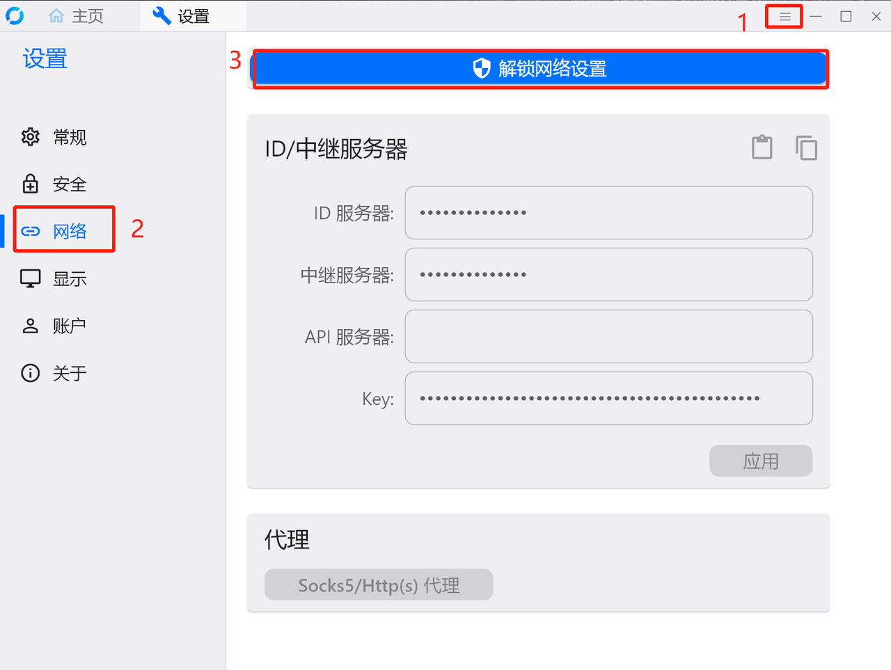
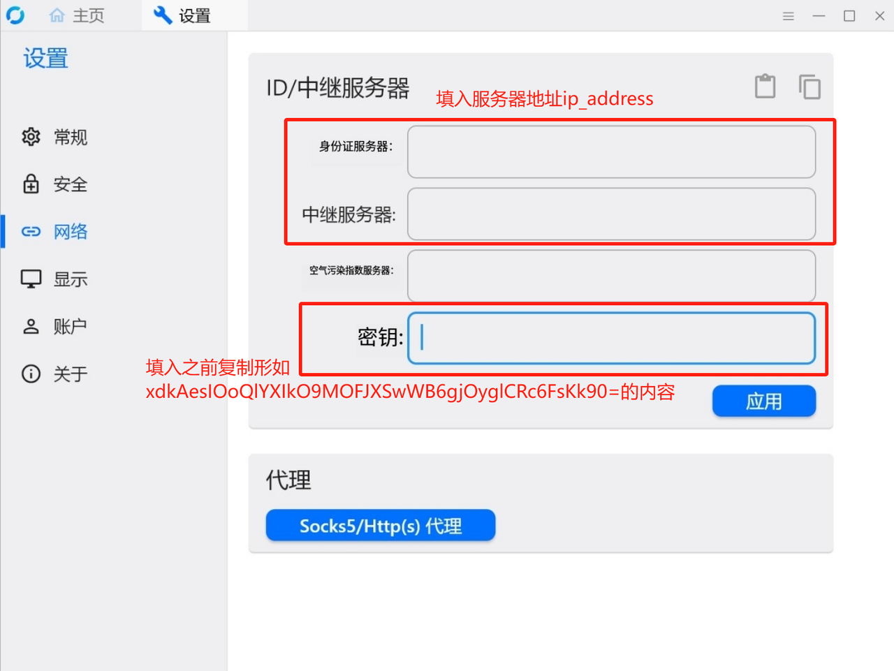
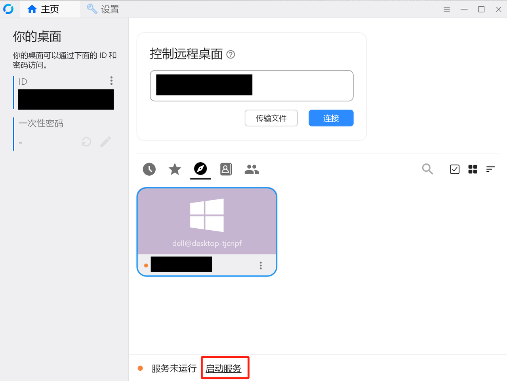
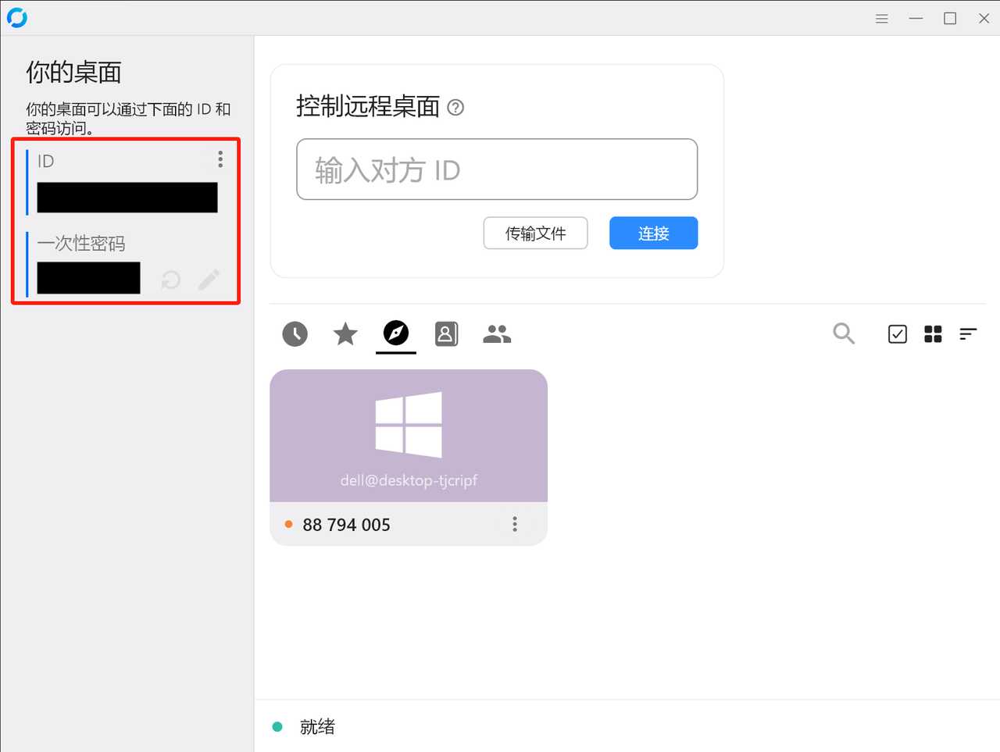
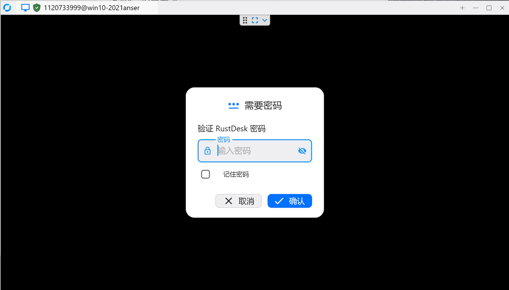

# Rustdesk远控

## Step 1 选择一个中继服务器(user@ip_address)部署服务端
```bash
ssh user@ip_address
mkdir rustdesk
wget https://github.com/rustdesk/rustdesk-server/releases/download/1.1.11-1/rustdesk-server-linux-amd64.zip
unzip rustdesk-server-linux-amd64.zip
cd amd64

# 部署hbbr服务
nohup ./hbbr > hbbr.log 2>&1 &

# 部署hbbs服务
nohup ./hbbs > hbbs.log 2>&1 &

# amd64目录下会有一个xxx.pub文件
ls
cat xxx.pub
# 复制形如xdkAesIOoQlYXIkO9MOFJXSwWB6gjOyglCRc6FsKk90=的内容
```

## Step 2 被控端安装rustdesk

### 1. Windows安装
https://github.com/rustdesk/rustdesk/releases/download/1.2.7/rustdesk-1.2.7-x86_64.exe

### 2. 选择设置-网络-解锁网络设置


### 3. 填入服务器地址之前复制的key，应用


### 4. 启动服务


### 5. 显示被控端ID和密码


## Step 3 控制端安装rustdesk

### 1-4步同上

### 5 输入被控端ID，显示如下界面并输入密码，成功远控

